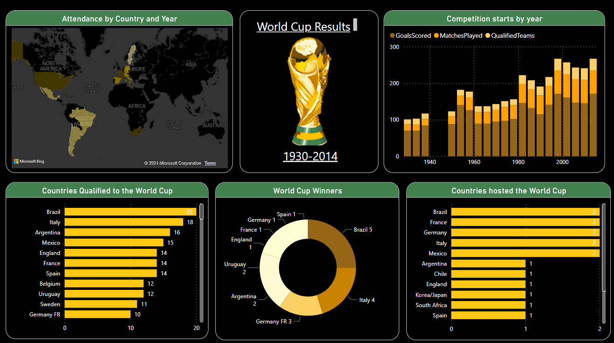

# FIFA World Cup Results 

## Overview
Welcome to the FIFA World Cup Results visualization project, spanning from the inaugural tournament in 1930 to the thrilling matches of 2014. This repository serves as a comprehensive analysis of the world's most prestigious football event, offering insights into match details, tournament dynamics, and historical trends.

## Data Tables
The project harnesses the power of three primary data tables:
1. **worldCupMatches**: Delve into the intricacies of each match, including scores, venues, and participating teams.
2. **WorldCups**: Gain a holistic view of each tournament, from host nations to eventual winners.
3. **World Cup-Tableau Format**: A specially formatted dataset tailored for seamless integration with Tableau for advanced visualization.

## Visualization Graphs
Unveil the story of the World Cup through a myriad of visualizations:
- **Stacked Column Chart**: Witness the evolution of the competition over decades, tracking the start years of each tournament.
- **Stacked Bar Charts**: Explore the participation dynamics, with one chart showcasing countries that qualified and another revealing those bestowed with the honor of hosting the prestigious event.
- **Donut Chart**: Celebrate the triumphs of nations, as depicted by the distribution of World Cup winners over the years.
- **Filled Map**: Embark on a journey around the globe, as attendance figures are mapped by country and year, offering insights into the global appeal of the World Cup.

## Conclusion
Drawing from the rich tapestry of FIFA World Cup data, several compelling insights emerge:
- The World Cup's allure transcends borders, with each tournament marking a milestone in the sport's global journey.
- Certain nations have etched their names into football history through repeated victories, reflecting the enduring spirit of competition.
- Host countries play a pivotal role in shaping the narrative of each tournament, amplifying the spectacle and fervor of the World Cup.

## Dataset & Logo
The dataset for this project is sourced from Kaggle, a reputable platform for data science enthusiasts. You can access the dataset [here](https://www.kaggle.com/datasets/abecklas/fifa-world-cup)). Additionally, the project repository includes the official FIFA World Cup logo, adding an authentic touch to the visualizations.

## Screenshot

